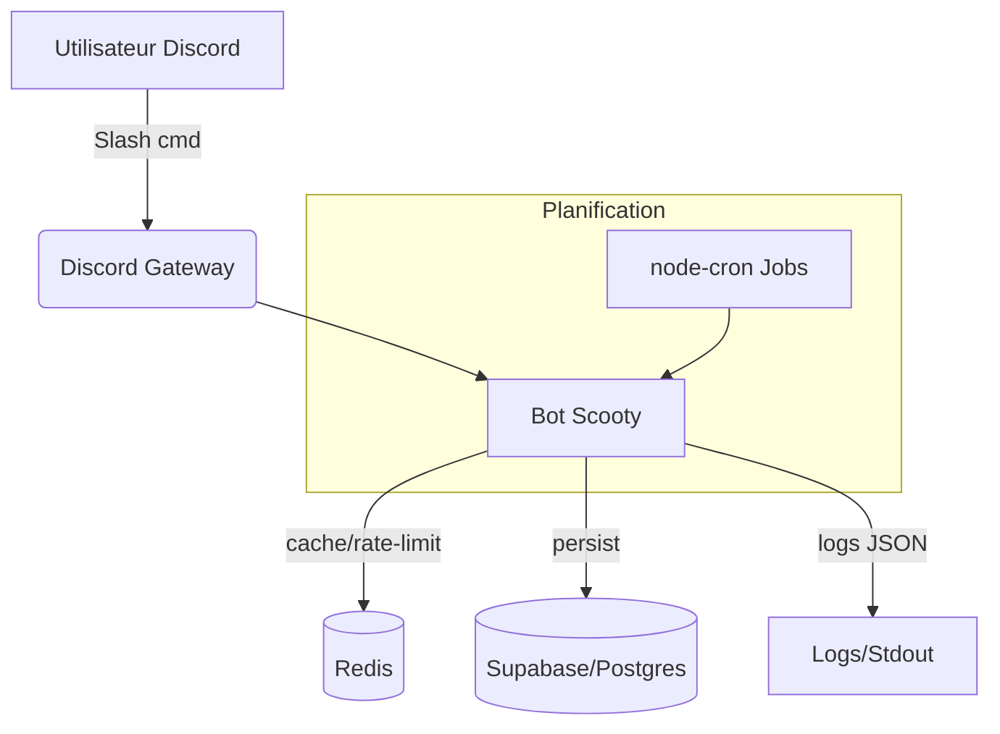

# Scooty — Architecture Technique

## Vue d'ensemble
Scooty est un bot Discord orienté compétitif MTG pour scouting et suivi de decks.
Il s'appuie sur Discord.js (v14), TypeScript, Redis pour la mise en cache/file d'attente,
Supabase pour la persistance/analytics, et un orchestrateur de jobs planifiés.

## Stack
- Runtime: Node.js >= 18, TypeScript
- Framework: discord.js v14
- Data: Supabase (Postgres), Redis (cache, rate-limit, jobs)
- Observabilité: Winston (logs structurés), (optionnel) OpenTelemetry
- Déploiement: Fly.io (ou conteneur équivalent)

## Modules principaux
- `src/bot.ts` — bootstrap client Discord, enregistrement intents, login, gestion du cycle de vie
- `src/commands/*` — commandes slash et handlers
- `src/services/*` — intégrations Supabase/Redis, logique métier
- `src/utils/*` — helpers, instrumentation, validations
- `src/__tests__/*` — tests unitaires (ts-jest)

## Flux applicatif
1. Démarrage: chargement config (env), initialisation Redis/Supabase, enregistrement des commandes
2. Événements Discord → router → handler de commande
3. Accès données (Supabase) + cache (Redis) + règles métier
4. Réponse Discord (message/embeds) + logs
5. Jobs planifiés (node-cron) pour tâches récurrentes (sync, nettoyage, reports)

## Config & Secrets
Variables d'environnement clés:
- `DISCORD_TOKEN`, `DISCORD_CLIENT_ID`, `DISCORD_GUILD_ID`
- `SUPABASE_URL`, `SUPABASE_ANON_KEY`
- `REDIS_URL`
- `NODE_ENV`, `LOG_LEVEL`

Recommandations:
- Stockage des secrets via Fly.io secrets / Vault
- Rotation régulière des tokens

## Rate limiting & robustesse
- Token Bucket via Redis (clé par commande/utilisateur)
- Retries exponentiels + jitter pour appels externes
- Circuit breaker (compteur d'échecs + backoff)

## Déploiement (Fly.io)
1. Build `npm run build`
2. Image (Docker) selon `Dockerfile` (si présent) ou `fly.toml`
3. Secrets: `fly secrets set DISCORD_TOKEN=...`
4. Healthchecks HTTP/TCP exposés (si applicable) et logs agrégés

## Monitoring & Logs
- Winston: format JSON, niveaux (info/warn/error), corrélation requête/commande
- Export vers stdout (capturé par la plateforme)
- (Optionnel) métriques Prometheus via passerelle

## Tests & Qualité
- Unitaires: Jest/ts-jest
- Couverture visée: >= 60% (court terme), >= 80% (moyen terme)
- Linting: ESLint + @typescript-eslint, Prettier

## Roadmap technique
- [P1] Rate-limit global + per-command + backoff
- [P1] Healthchecks Fly.io + readiness
- [P2] Tracing minimal + métriques clés
- [P2] Tests d'intégration (mocks Discord)

---

## Schéma d'architecture (Mermaid)

## Checklist réinstallation / vérification
- Node.js 18+ installé (`node -v`)
- `npm ci` OK, build TypeScript OK
- Secrets configurés (Discord, Redis, Supabase)
- Commandes slash enregistrées
- Redis reachable (`PING`), Supabase simple query OK
- Health `ping` OK, logs sans erreurs
